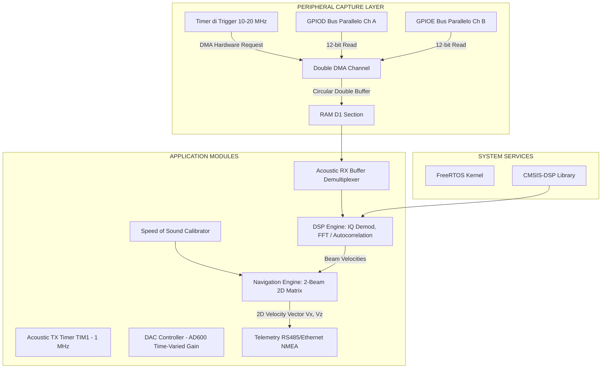

# ☤ Firmware di OpenDVL (STM32H7 - C/C++)

Questo modulo racchiude il codice sorgente, l'architettura software e il sistema di build del firmware per la scheda di controllo dell'OpenDVL, basata su microcontrollore **STM32H7 (Nucleo Motherboard)** con shield di condizionamento acustico.

---

## 📐 Architettura del Software e Periferiche

Il firmware sfrutta le prestazioni elevate del core ARM Cortex-M7 a 480 MHz per gestire l'acquisizione parallela dei due bus digitali dell'ADC esterno e calcolare gli algoritmi DSP in tempo reale.



---

## ⚡ Pipeline di Processing Acustico (DSP Engine)

Il sistema a due trasduttori da 1 MHz è configurato per misurare la velocità bidimensionale (velocità orizzontale di avanzamento e velocità verticale di discesa/salita). Ciascun *ping acustico* segue questo flusso di elaborazione:

### 1. Generazione del Ping Acustico (TX - 1 MHz)
- Il timer avanzato **TIM1** viene configurato per generare un burst PWM a **1 MHz** (durata tipica di 1-3 ms, circa 1000-3000 cicli acustici).
- Il segnale PWM pilota il driver di gate **MAX4427CPA+** che eccita rapidamente i MOSFET di potenza per inviare l'energia acustica in acqua.
- **TVG Control**: In contemporanea al termine della trasmissione, un canale **DAC** della MCU avvia una rampa di tensione analogica inviata al pin di controllo del guadagno del chip **AD600JNZ** (V_G, da -0.625 V a +0.625 V). Questo alza progressivamente il guadagno dell'AFE da 0 dB a 40 dB per compensare l'assorbimento dell'acqua a 1 MHz, che è notevolmente superiore rispetto alle basse frequenze.

### 2. Acquisizione parallela ad alta velocità via DMA
- I due chip **AD9226** forniscono in parallelo dati a 12-bit.
- Per evitare il collo di bottiglia della CPU, configuriamo il timer **TIM2** per scattare a una frequenza di campionamento costante (es. **10 MHz** o **20 MHz**).
- Ciascun impulso di clock del timer avvia una richiesta DMA (Direct Memory Access) che campiona simultaneamente:
  - I 12 bit di **GPIOD->IDR** (collegati all'ADC Ch A - Trasduttore 1)
  - I 12 bit di **GPIOE->IDR** (collegati all'ADC Ch B - Trasduttore 2)
- Il DMA deposita i dati in un buffer circolare allocato nella velocissima memoria RAM D1 della MCU STM32H7.

### 3. Filtrazione Digitale e Demodulazione IQ
- Il segnale digitale a 1 MHz viene filtrato con un filtro passa-banda digitale FIR passa-basso/banda centrato a 1 MHz (sfruttando la libreria `CMSIS-DSP`).
- Si effettua la demodulazione IQ moltiplicando digitalmente il segnale acquisito per una sinusoide e una cosinusoide locali a 1 MHz, estraendo le componenti in fase (I) e quadratura (Q) in banda base. Questo riduce la frequenza effettiva dei campioni da elaborare.

### 4. Algoritmo di Stima della Frequenza Doppler
- Si applica l'algoritmo di **Autocorrelazione (metodo di Rummler)** sul segnale IQ in banda base. Questo metodo stima lo sfasamento medio tra campioni successivi ed è incredibilmente rapido ed efficiente per l'elaborazione in tempo reale sulla MCU.
- In alternativa, si effettua una FFT a 1024 punti sui dati per localizzare lo spostamento del picco di frequenza rispetto alla portante di 1 MHz.

### 5. Compensazione della Velocità del Suono (c)
La velocità di propagazione del suono in acqua varia principalmente con la temperatura. Il firmware la compensa in tempo reale tramite l'equazione di **Clay-Medwin**:

```text
c = 1449.2 + 4.6 * T - 0.055 * T^2 + 0.00029 * T^3 + (1.34 - 0.01 * T) * (S - 35) + 0.016 * z
```

Dove:
- `T` è la temperatura misurata (in °C).
- `S` è la salinità dell'acqua (tipicamente impostata a 35 ppt per acqua marina o 0 ppt per acqua dolce).
- `z` è la profondità di lavoro calcolata in base al sensore di pressione (in metri).

### 6. Trasformazione Geometrica 2D
Nel nostro sistema bidimensionale a 2 fasci acustici orientati ad un angolo di inclinazione alpha (es. 30 gradi) rispetto alla verticale:
- Il trasduttore 1 (Beam 1) è inclinato in avanti di +alpha gradi.
- Il trasduttore 2 (Beam 2) è inclinato all'indietro di -alpha gradi.

Le velocità lineari lungo i due fasci (b1, b2) stimate tramite i rispettivi spostamenti Doppler (df1, df2) vengono convertite nel vettore di velocità del veicolo:
- **Velocità Orizzontale (avanzamento, Vx)**:
  ```text
  Vx = c * (df1 - df2) / (4 * f0 * sin(alpha))
  ```
- **Velocità Verticale (discesa/salita, Vz)**:
  ```text
  Vz = c * (df1 + df2) / (4 * f0 * cos(alpha))
  ```
*(dove f0 = 1,000,000 Hz è la frequenza nominale del trasduttore).*

---

## 📂 Struttura della Cartella `firmware/`

- `CMakeLists.txt`: Configurazione di build principale.
- `toolchain-arm.cmake`: File di configurazione per la toolchain cross-compiler `arm-none-eabi`.
- `Core/`:
  - `Src/main.c`: Inizializzazione della scheda Nucleo H7 (Clocks a 480 MHz, GPIO DMA per AD9226, DAC per AD600).
  - `Src/stm32h7xx_it.c`: Gestori delle interruzioni di DMA e TIM.
- `App/`:
  - `Src/acoustic_tx.c`: Gestione del trigger a 1 MHz tramite TIM1.
  - `Src/acoustic_rx.c`: Gestione del DMA parallelo per GPIOD e GPIOE.
  - `Src/dsp_engine.c`: Demodulazione IQ, filtri FIR, calcolo dello spostamento Doppler a 1 MHz.
  - `Src/navigation.c`: Conversione geometrica 2D (Vx, Vz) e calcolo della velocità del suono.
  - `Src/telemetry.c`: Formattazione pacchetti seriali NMEA.

---

## 🛠️ Istruzioni per la Compilazione

### Requisiti
- **GCC Toolchain per ARM**: `arm-none-eabi-gcc` nel PATH del sistema.
- **CMake**: Versione 3.20 o superiore.
- **Ninja** o **Make**.

### Procedura di Build
```bash
cd firmware
mkdir build
cd build
cmake -DCMAKE_TOOLCHAIN_FILE=../toolchain-arm.cmake -G "Unix Makefiles" ..
make -j4
```
I file compilati finali (`.elf`, `.hex`, `.bin`) verranno generati nella cartella `build/`.
